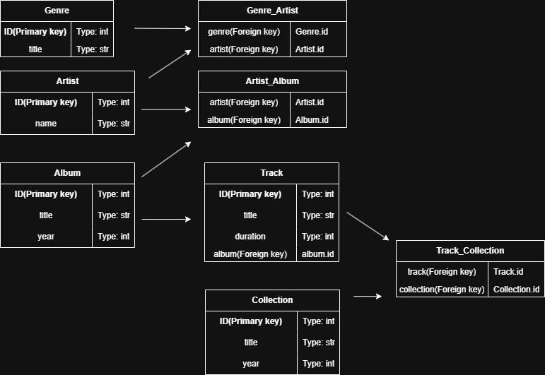

# Домашка 1

Блок схема бд:

SQL-запросы, создающие спроектированную БД.

    CREATE TABLE Genre (
        id INT PRIMARY KEY,
        title VARCHAR(50) not null
    );  

    CREATE TABLE Artist (
        id INT PRIMARY KEY,
        name VARCHAR(50) not null
        
    );

    CREATE TABLE Album (
        id INT PRIMARY KEY,
        title VARCHAR(50) not null,
        year INT
        
    );

    CREATE TABLE Track (
        id INT PRIMARY KEY,
        title VARCHAR(50) NOT NULL,
        duration INT,
        album INT,
        FOREIGN KEY (album) REFERENCES Album(id)
        
    );

    CREATE TABLE Collection (
        id INT PRIMARY KEY,
        title VARCHAR(50) NOT NULL,
        year INT
        
    );

    CREATE TABLE Genre_Artist (
        genre INT,
        artist INT,
        FOREIGN KEY (genre) REFERENCES Genre(id),
        FOREIGN KEY (artist) REFERENCES Artist(id)
        
    );

    CREATE TABLE Artist_Album (
        artist INT,
        album INT,
        FOREIGN KEY (artist) REFERENCES Artist(id),
        FOREIGN KEY (album) REFERENCES Album(id)
        
    );

    CREATE TABLE Track_Collection (
        track INT,
        collection INT,
        FOREIGN KEY (track) REFERENCES Track(id),
        FOREIGN KEY (collection) REFERENCES Collection(id)
        
    );
